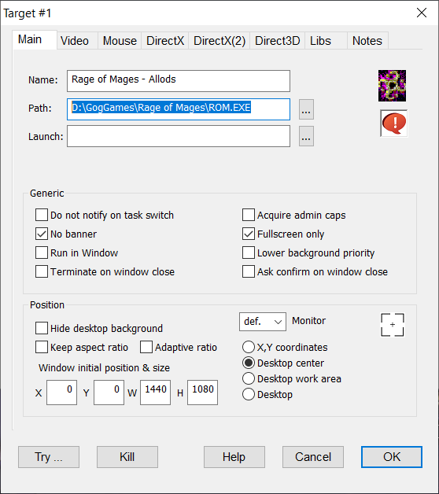

19.01.2022 Win10 x64

### Игра

https://www.gog.com/game/rage_of_mages

### Зависание видео

Заменить файл smackw32.dll в папке с установленной игрой на файл из этой папки.

Проблема возникает не всегда, поэтому делать ее сходу не стоит, также иногда замена приводит к мерцанию видео.

### DxWnd

https://sourceforge.net/projects/dxwnd/

При проблемах с запуском игры через созданный оригинальным инсталлятором ярлык:

1. Скачать DxWnd и распаковать в любое место.
2. Запустить DxWnd, в окне выбрать File -> Import -> папка DxWnd -> exports -> Rage of Mages.
3. Изменить настройки (Rclick -> Modify); см. скриншот.
4. В папке игры переименовать ddraw.dll to ddraw.dll.baсkгз.
5. Запускать игру GOG ярлыком при запущенном DxWnd.

