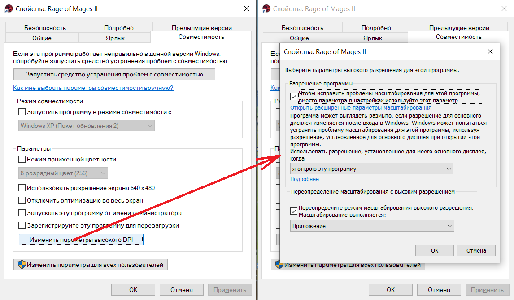

:clipboard: 24.01.2022 Win10 x64

## Аллоды 2: Повелитель душ

:star: :star: :star: :star: :star:

### Игра

https://www.gog.com/game/rage_of_mages_ii_necromancer

### Патч высокого разрешения

- Скачать [архив](https://github.com/Unicornum/Db.Games/releases/download/Allods/a2_acom_14.zip) и распаковать его в папку с игрой.
- В свойствах ярлыка заменить исполняемый файл и добавить нужное разрешение:

> "<...>\Rage of Mages II\allods2com14.exe" --res:1920x1080 --single

- Если в свойствах монитора включен увеличенный шрифт, то в настройках ярлыка отключить масштабирование:

[Источник](http://www.wsgf.org/dr/rage-mages-2-necromancer)

## Хинты

- В начале игры можно выбрать за кого играть (бойца или мага), но затем к игроку присоединится воин, а еще чуть позже - маг. Поэтому следует выбирать мага, т.к. играть связкой воин + маг проще, чем двумя бойцами, а бойцом и двумя магами - значительно проще, чем двумя бойцами и магом.
- При переходе из города в город либо при загрузке сейва ассортимент магических вещей в магазинах обновляется.
