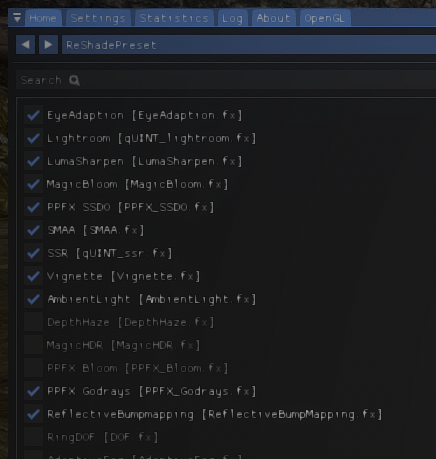
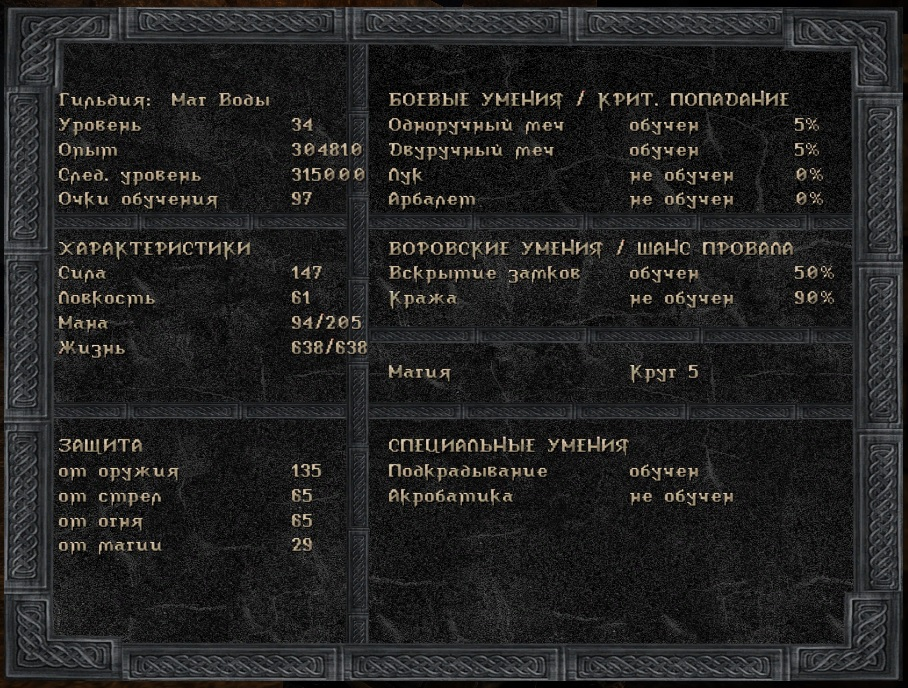

:clipboard: 25.02.2023 Win10 x64

## Gothic

:star: :star: :star: :star: :star:

### Игра

https://www.gog.com/game/gothic

### System Pack

[Источник](https://rpgrussia.com/resources/systempack.643/)

1. Установить [Gothic1_playerkit-1.08k](https://github.com/Unicornum/Db.Games/releases/download/Gothic/1.Gothic1_playerkit-1.08k.exe)
2. Установить [Gothic1_PlayerKit-2.8](https://github.com/Unicornum/Db.Games/releases/download/Gothic/2.Gothic1_PlayerKit-2.8.exe)
3. Установить [G1Classic-SystemPack-1.8](https://github.com/Unicornum/Db.Games/releases/download/Gothic/3.G1Classic-SystemPack-1.8.exe)

### Русификатор

[Скачать](https://github.com/Unicornum/Db.Games/releases/download/Gothic/G1LangPack.Cyrillic.-0.2.exe)

> Установщик позволяет выбрать одну из двух локализаций, каноничная - от Snowball.

### Рендеринг с помощью DirectX 11

Скачать [архив](https://github.com/Unicornum/Db.Games/releases/download/Gothic/Gothic1-GD3D11-v17.8-dev9.zip), распаковать в папку system игры.

[Источник](https://github.com/Kirides/GD3D11/releases)

Предыдущие проверенные версии:

- https://github.com/Unicornum/Db.Games/releases/download/Gothic/GD3D11-17.8-dev8.zip

### Графические моды

- [G2 Meshes And Textures Pack](https://github.com/Unicornum/Db.Games/releases/download/Gothic/1.G2-Meshes-And-Textures-Pack-v0.2b-Setup.exe) - модели и текстуры из Gothic 2.
- [Big Nature Mod](https://github.com/Unicornum/Db.Games/releases/download/Gothic/2.Big-nature-mod.exe) — более красивые деревья и значительно больше растительности и других мелких деталей на земле и водоемах.
- [Textures Patch Freddy](https://github.com/Unicornum/Db.Games/releases/download/Gothic/3.Textures_Patch_Freddy-0.8.exe) — обновленные текстуры на манер Gothic 2.
- [Worlds Patch Freddy](https://github.com/Unicornum/Db.Games/releases/download/Gothic/4.worlds_patch_freddy-1.01.exe) — исправление ошибок предыдущего мода.
- [Carnage Graphics Patch](https://github.com/Unicornum/Db.Games/releases/download/Gothic/5.Carnage_Graphics_patch.VDF) — улучшенные модели персонажей и некоторых объектов.
- [Gothic Weapons Rebuilt](https://github.com/Unicornum/Db.Games/releases/download/Gothic/6.Gothic_Weapons_Rebuilt.VDF) - улучшенные модели оружия.
- [Potions](https://github.com/Unicornum/Db.Games/releases/download/Gothic/7.Potions.vdf) - модели зелий из второй части.

Первые три мода устанавливаются через инсталлятор на немецком — просто нажимайте привычные по расположению клавиши (но проследите, чтобы путь к игре был корректным), файлы .vdf нужно скопировать в папку Gothic\Data.

Для объединения G2MeshesAndTexturesPack и всего остального добавить в файл system/GothicGame.ini

```
vdf=G2MATP.mod  GothicGame.mod // два пробела между файлами!
```

### ReShade

[Скачать](https://github.com/Unicornum/Db.Games/releases/download/common/ReShade_Setup_4.9.1.exe), [установить и настроить](https://github.com/Unicornum/Db.Games/releases/download/common/ReShade.pdf).

- DisplayDepth показывает наличие карт нормалей и глубины - они необходимы для работы многих шейдеров.
- Многие эффекты уже предоставлены Render DirectX 11, поэтому следует включать только то, чего нет.
- Для настройки нужен независимый курсор, для этого нажать сначала F1.



[Источник](https://reshade.me/)

### Разное

- В файле SystemPack.ini есть много полезных настроек.
- Быстрое сохранение - F5 (сохраняется в 15-й слот).
- Интро в игре начинается с черного экрана (несколько первых секунд), так что если отображается видео заставки, то все в порядке (если нет, нужно установить кодеки).

### Хинты

- Практика показала, что очень удачен подход, при котором сначала выполняются квесты небоевого характера, получение навыка взлома и подкрадывания, а уже затем вложения навыков в боевые навыки.
- Здравый смысл подсказывает, что меч Хранителя не так уж и нужен. Поначалу есть хороший топор в сундуке у кузнеца в Болотном лагере; Уризель же требует 30 силы и столько к тому времени уже будет за счет зелий, так что силу качать также незачем (а кольца +5 силы доступны уже в первой главе).
- Силу +5 от бывшего кузнеца на рисовых полях можно получить уже в первой главе после избиения Лефти.
- После вступления в Новый Лагерь сразу выдают новую броню (и еще одну можно выкупить у Волка), но вторая глава начинается только после прихода в Болотный лагерь.
- Магию выше 4-го круга качать незачем, заклинаниями 'Огненный Шторм' и 'Смерть Нежити' безо всяких проблем вычищается все живое, включая орков и Храм Спящего.
- Ману очками навыков можно поднять только до 100, поэтому имеет смысл отложить увеличение маны зельями до конца (впрочем, больше 100 особо и не нужно, а зельями ее можно поднять аж до 150+).

### Скриншоты



