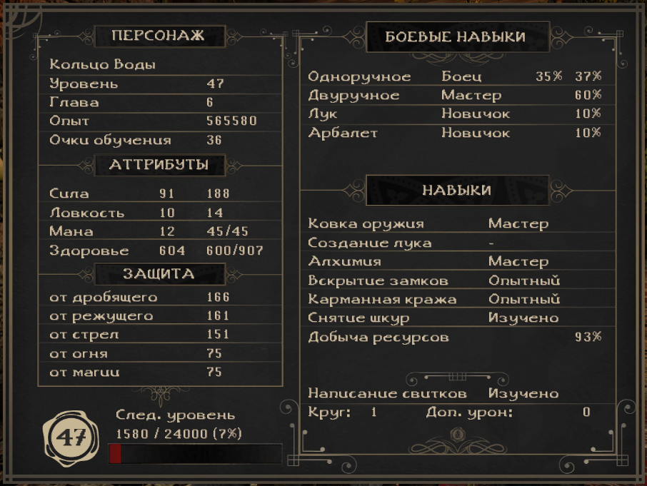

:clipboard: 20.10.2022 Win10 x64

## The Chronicles of Myrtana: Archolos

:star: :star: :star: :star:

### Игра

https://www.gog.com/en/game/the_chronicles_of_myrtana_archolos

> 20.10.2022: В Chrome ссылка не открывается ни при каких условиях, открывать в другом браузере или через список игр.

### Рендеринг с помощью DirectX11

Скачать [архив](https://github.com/Unicornum/Db.Games/releases/download/Gothic/GD3D11-17.8-dev8.zip), распаковать в папку system игры.

[Источник](https://github.com/SaiyansKing/GD3D11/releases)

### Настройки

В файле Gothic.ini можно: 
- увеличить чувствительность мыши (mouseSensitivity=2.5).
- отключить стартовые видео логотипы (параметр playLogoVideos=0)
- включить масштабирование видео (параметр scaleVideos=1)
- включить быстрое сохранение/загрузку (F5/F9; useQuickSaveKeys=1).
- Возможность быстро пить элексиры в бою (???в меню нет настроек кнопки??? usePotionKeys=1).

В файле SystemPack.ini:
- увеличить параметр reserveInMb=5000, иначе сохранения время от времени !!!ЛОМАЮТСЯ!!! (поэтому следует чаще сохраняться в другой слот и бэкапить их).

### Хинты

- Первый раз играл двуручем (много страдал) за стражников.
- Каждые 22 яблока дают +1 к силе.
- Рыцарский доспех можно вообще не покупать (доспехи Кольца Воды все равно лучше, дают их бесплатно, а до них можно дойти и в мастерском доспехе Волчьего Логова), а деньги лучше потратить на книги (у Венцеля), улучшающие характеристики.
- Лучший посох в игре требует 230 маны.
- Храм на болоте открывается мечом, который дают за сданные монетки в музее. Бойцу - дверь направо, магу - налево.

### Октябрь 2022

